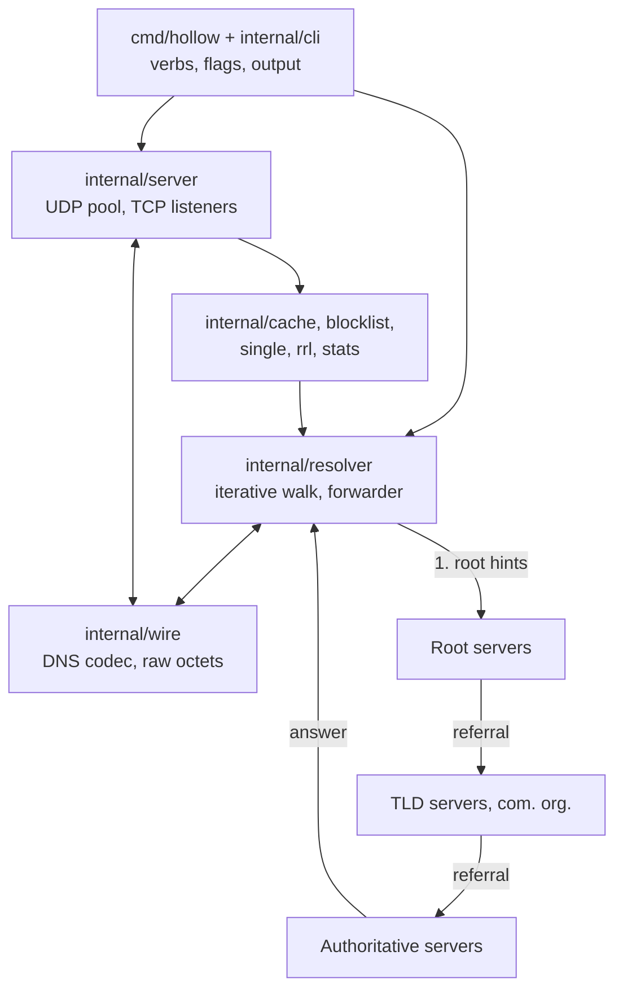

<div align="center">

# hollow

**A DNS resolver, server and toolkit that answers to nobody.**

Walks the root servers itself. Filters ads. Shows its work.
One static binary, four platforms, and an empty `go.mod`.

`0 dependencies` · `0 go.sum` · `0 vendor/` · `342 tests` · `86% covered` · `reproducible builds`

</div>

---

Most DNS tools ask somebody else. `dig` and `nslookup` hand your question to a stub resolver; most Go DNS software is a wrapper around one third-party library. `hollow` does the actual work: it starts at the IANA root servers, follows delegations down to the authoritative nameserver, and validates every hop along the way.

It is built entirely on the Go standard library. Not "almost", not "one small helper". The `go.mod` is a module line and a go line.

```bash
go build ./cmd/hollow    # nothing to fetch, nothing to resolve, nothing to trust
```

## Features

|  | |
|---|---|
| **Recursive resolver** | Real root-to-authoritative iteration with bailiwick checking, bounded work and CNAME loop detection. No upstream in the default path. |
| **Filtering DNS server** | Concurrent UDP and TCP. Reads hosts, domain-per-line and adblock lists. Three block modes, allowlists, synthetic SOA on every negative answer. |
| **Answer cache** | Sharded with LRU eviction, RFC 2308 negative caching, RFC 8767 serve-stale, and request coalescing so a thundering herd costs one walk. |
| **Forgery resistance** | `crypto/rand` transaction IDs, per-query source ports from connected sockets, and DNS 0x20 case randomisation. 34 to 51 bits an attacker must guess. |
| **Rate limiting** | Per client network, `/24` and `/56`, with BIND-style slip so real clients recover over TCP while spoofed sources get nothing. |
| **Live dashboard** | Attaches to a running server over a loopback control socket. No raw mode on any platform. |
| **Protocol X-ray** | `trace` draws the delegation path actually walked. `inspect` accounts for every octet of a reply. |
| **Verifiable builds** | Byte-identical output from any directory, four published SHA-256 hashes, and a build gate that fails if the README goes stale. |

## See it work

**Watch a running server.** `hollow dash` attaches over the control socket and redraws on a timer:

```
┌─ hollow ───────────────────────────────────────────────── 127.0.0.1:15354  up 1m39s ─┐
│ qps 539     cache 87.0%   blocked 21.8%   p50 0.42ms    p99 61ms                     │
│ ▂▁▁▁▁▁▂▂▂▂▂▂▃▃▃▃▃▄▄▄▄▄▄▅▅▅▅▅▆▆▆▆▆▆▇▇▇▇▇█                                             │
├──────────────────────────────────────────────────────┬───────────────────────────────┤
│ LIVE                                                 │ TOP NAMES                     │
│ 20:41:07 10.0.0.7        A     NOERROR  stale.e…et. ~│  1 cdn.example.com.      4821 │
│ 20:41:06 2001:db8::beef  MX    SERVFAIL mail.ex…rg.  │  2 api.service.io.       3204 │
│ 20:41:04 10.0.0.9        AAAA  blocked  ads.tra…et.  │                               │
│ 20:41:03 10.0.0.4        A     NOERROR  cdn.exa…om. +│ TOP BLOCKED                   │
├──────────────────────────────────────────────────────┴───────────────────────────────┤
│ cache 84213 entries   stale 41   dropped 0   ^C quit                                 │
└──────────────────────────────────────────────────────────────────────────────────────┘
```

**See the walk.** Real output, not a mock. Note `asked as WWw.gitHub.COM.`: that is 0x20 case randomisation, a nonce an off-path attacker has to guess:

```
$ hollow trace www.github.com

. (root)
+- 198.97.190.53:53                                              169ms  udp, referral, 839 B, 13 NS + 26 glue, 1 of 26 servers
   asked as WWw.gitHub.COM.
   com.
   +- f.gtld-servers.net. ([2001:503:d414::30]:53)               194ms  udp, referral, 310 B, 8 NS + 2 glue, 1 of 26 servers
      asked as wWW.Github.COM.
      github.com.
      +- ns-421.awsdns-52.com. ([2600:9000:5301:a500::1]:53)      32ms  udp, answer, 296 B, 1 of 2 servers

www.github.com. 3600 IN CNAME github.com.
github.com. 60 IN A 20.207.73.82

3 queries, 3 zones, 0 answers from cache, 395ms
```

**Read the octets.** Every field named by the decoder that read it, compression pointers resolved:

```
$ hollow inspect example.com

0002  84 00                    flags QR=1 opcode=0 AA=1 TC=0 RD=0 RA=0 AD=0 CD=0 rcode=0
000c  07 65 78 61 6d 70 6c 65  QNAME example.com. = "example" "com"
0014  03 63 6f 6d 00
001d  c0 0c                    NAME example.com. = pointer to 0x000c
0027  00 04                    RDLENGTH 4
0029  ac 42 93 f3              RDATA address 172.66.147.243
```

## Install

**Linux and macOS**

```bash
curl -fsSL https://raw.githubusercontent.com/DevInIndia/hollow/main/install.sh | sh
```

**Windows**, in PowerShell

```powershell
irm https://raw.githubusercontent.com/DevInIndia/hollow/main/install.ps1 | iex
```

The installer picks the binary for your platform, verifies it against the `SHA256SUMS` published with the release, and installs to `~/.local/bin` (`%LOCALAPPDATA%\hollow\bin` on Windows). A checksum mismatch installs nothing, and nothing runs as root. Set `HOLLOW_INSTALL_DIR` to change where it lands, or `HOLLOW_VERSION=v1.0.1` to pin a release.

Piping a script into a shell is worth being wary of, so read it first if you prefer:

```bash
curl -fsSL https://raw.githubusercontent.com/DevInIndia/hollow/main/install.sh -o install.sh
less install.sh && sh install.sh
```

**Other ways**

```bash
go install github.com/DevInIndia/hollow/cmd/hollow@latest   # if you have Go
go build ./cmd/hollow                                       # from source
docker build -t hollow . && docker run --rm -p 15353:15353/udp hollow
```

Or take a binary straight from [Releases](../../releases).

Prebuilt binaries cover linux/amd64, linux/arm64, darwin/arm64 and windows/amd64. Intel Macs and anything else build from source. Statically linked, `CGO_ENABLED=0`, no libc.

## Usage

**Resolve a name**

```bash
hollow resolve example.com
hollow resolve google.com MX
hollow resolve --json example.com
hollow resolve --server 8.8.8.8 example.com      # ask one server instead of iterating
```

**Run the server** on a port needing no privileges:

```bash
hollow serve                                     # 127.0.0.1:15353, udp and tcp
dig @127.0.0.1 -p 15353 example.com

hollow serve --verbose --workers 128 --timeout 3s
```

**Block ads and trackers.** Hosts format, domain-per-line and adblock `||domain^` all read by the same parser:

```bash
curl -o hosts.txt https://raw.githubusercontent.com/StevenBlack/hosts/master/hosts
hollow serve --block hosts.txt
hollow serve --block hosts.txt --allow keep.txt        # the allowlist wins
hollow serve --block hosts.txt --block-mode null       # 0.0.0.0 instead of NXDOMAIN
```

**Forward instead of walking**, for networks that only allow their own resolvers. Repeatable, tried in order:

```bash
hollow serve --forward 1.1.1.1 --forward 8.8.8.8
```

**Watch it live.** The control socket is opt-in; nothing extra binds without the flag:

```bash
hollow serve --control 127.0.0.1:15354

# in another terminal
hollow stats --json | jq .cache_hits
hollow dash
hollow dash --ascii --width 120 --height 40
```

## How it works



Every reply is untrusted input. Glue addresses are bailiwick-checked against the zone that sent them, comparing labels rather than string suffixes, so `evil\.com` is never mistaken for a child of `com`. Referrals must descend strictly below the zone just asked. Work is bounded at 16 delegations, 64 queries and 8 CNAME links per resolution. `RD` is cleared on every iterative query, because a server that honoured it would return an answer whose delegation path was never checked.

| Package | Role |
|---|---|
| `internal/wire` | DNS codec: header, question, RR, EDNS0, compression both directions, fuzz target over `Unpack` |
| `internal/resolver` | UDP transport with TCP fallback, the iterative loop, and the forwarder |
| `internal/server` | UDP worker pool, TCP listeners, graceful shutdown |
| `internal/cache` | Sharded store, LRU, negative caching, serve-stale |
| `internal/blocklist` | Hosts, domain and adblock parsing, suffix matching, block modes |
| `internal/control` · `internal/tui` | Control socket and dashboard |
| `internal/roothints` · `single` · `stats` · `rrl` | Root hints, coalescing, counters, rate limiting |

## Zero dependencies, and the proof

A conventional Go build of this project would install these. Every one is a good package; the point is that the standard library was enough.

Counts are pkg.go.dev's **"Known importers"**, read 2026-08-30 from each `?tab=importedby` page. That is packages the module index knows import it, not downloads.

| Would normally install | Importers | What `hollow` does instead |
|---|---|---|
| [`sirupsen/logrus`](https://pkg.go.dev/github.com/sirupsen/logrus?tab=importedby) | 239,958 | `log/slog` with a `TextHandler`. It forced one decision into the open: only the first dropped UDP packet is logged and the rest counted, so a packet flood does not become a disk flood. |
| [`spf13/cobra`](https://pkg.go.dev/github.com/spf13/cobra?tab=importedby) | 195,884 | `flag` and a verb switch. `ContinueOnError` with an explicit `SetOutput`, so a bad flag returns an exit code instead of calling `os.Exit`, which makes every verb testable. |
| [`stretchr/testify/require`](https://pkg.go.dev/github.com/stretchr/testify/require?tab=importedby) | 18,870 | `testing`, `testing/synctest` and `reflect.DeepEqual`, every assertion spelled out. |
| [`miekg/dns`](https://pkg.go.dev/github.com/miekg/dns?tab=importedby) | 16,234 | `internal/wire`: 1,341 lines over `encoding/binary` and `net/netip`, nine record types, RFC 3597 for unknown ones. |
| [`stretchr/testify/assert`](https://pkg.go.dev/github.com/stretchr/testify/assert?tab=importedby) | 16,016 | As above. |
| [`golang.org/x/time/rate`](https://pkg.go.dev/golang.org/x/time/rate?tab=importedby) | 14,348 | `internal/rrl`: a token bucket per client network over `container/list`, a shape `rate.Limiter` does not have. |
| [`charmbracelet/bubbletea`](https://pkg.go.dev/github.com/charmbracelet/bubbletea?tab=importedby) | 11,682 | `internal/tui`: hand-rolled ANSI, one buffered write per frame, no raw mode anywhere. |
| [`golang.org/x/sync/singleflight`](https://pkg.go.dev/golang.org/x/sync/singleflight?tab=importedby) | 3,802 | `internal/single`, about 130 lines, generic over key and value. |
| [`hashicorp/golang-lru/v2`](https://pkg.go.dev/github.com/hashicorp/golang-lru/v2?tab=importedby) | 1,261 | `internal/cache` over `container/list` and `hash/maphash`. A DNS cache rewrites every TTL on the way out, which nothing off the shelf does. |

Those nine entries are seven modules. Their own published `go.mod` files, fetched from `proxy.golang.org`, pull in ten more, and `bubbletea` alone declares another seventeen. **That is 17 third-party modules before the TUI, against 0 here.** The figure is a floor: manifests expanded one level, not a full transitive closure.

```bash
cat go.mod                                  # a module line and a go line, no require block
ls go.sum vendor                            # neither exists
go list -deps ./... | grep '^[^/]*\.'       # no output: nothing outside the standard library
```

Recorded with output in [deps-proof.txt](deps-proof.txt). `make verify` fails the build if any of it stops being true.

[STDLIB.md](STDLIB.md) documents all 41 substitutions and what each one cost.

## Reproducible builds

The same source produces byte-identical output from any directory. Built with go1.25.0 and `CGO_ENABLED=0`:

| Target | Artifact | SHA-256 |
| --- | --- | --- |
| linux/amd64 | `hollow-linux-amd64` | `dd3586d6a900deda5311556153661f4d38c9dc0b437ac5535a194b5fda605182` |
| linux/arm64 | `hollow-linux-arm64` | `89388445e2ea0271edfab9b776665a0e84db7dc30dcc1ea6332a357a09869db1` |
| darwin/arm64 | `hollow-darwin-arm64` | `483ac3a8be85ca787c09ffc48eab4603f0cfceba3d3bf619d6a14f9f93bfab26` |
| windows/amd64 | `hollow-windows-amd64.exe` | `b24d69c0c6638f85705fa7fed596c3f22b0851573b8606fc9172bbca1482e574` |

**Only linux/amd64 is gated.** `make verify` rebuilds and compares against that row, because it is the only platform whose bytes this repository can reproduce. The other three come from the same command and the same flags, and this file says so rather than implying a check that did not happen.

The gated row is not a promise, it is a gate: a stale hash breaks the build rather than quietly misleading a reader.

```bash
make reproduce   # builds twice, compares the bytes
make release     # writes dist/ and dist/SHA256SUMS
```

The [Dockerfile](Dockerfile) is multi-stage ending at `FROM scratch`: one layer, one static binary, 5.11 MB, uid 65534. The builder is pinned to `golang:1.25.0`, so the binary inside the image is byte identical to the gated row. No CA bundle (DNS carries no TLS), no `/etc/resolv.conf` (it walks from the root), no `go mod download` (there is nothing to download).

## Limitations

Stated plainly, because a resolver that hides these is worse than one that names them.

* **DNSSEC is not implemented.** EDNS0 is present and the DO bit is decoded, but nothing is validated. A forged delegation from a compromised parent would not be detected. Half-done validation is worse than none, because a resolver reporting AD on evidence it did not check lies to everything downstream.
* **The cache does not survive the process.** A restart starts cold.
* **A forwarded answer is trusted absolutely.** Under `--forward` there is no delegation path to check, so choosing a forwarder is choosing whom to believe. No health checking either, so a dead first entry costs one timeout per query.
* **Adblock `$` options are honoured without their conditions**, so those blocks are broader than the rule asked for. Element hiding, `@@` exceptions and regex rules are skipped and counted.
* **Resource limits are global, not per client.** One client can occupy all 64 workers or all 256 connections. Rate limiting counts responses sent, not work done.
* **0x20 protects the path, not the server at the end of it.** A compromised nameserver echoes the nonce correctly, and a short name carries little entropy.
* **Blocklists load once, at startup.** No reload. Every control socket command reads and none change behaviour, which is what makes an unauthenticated loopback port defensible.
* **The dashboard cannot read terminal size** and does not notice a resize. Size comes from `COLUMNS`/`LINES`, then flags, then 100x30. No keyboard, because everything else needs raw mode.
* **Not authoritative.** No zone file serving, no PTR from a local table.

## Building and testing

```bash
make build       # the binary
make test        # 342 tests under -race
make verify      # the full gate: tidy, no require block, no go.sum, no vendor,
                 # gofmt, vet, race tests, four cross-compiles, hash check
make release     # four platforms into dist/ with SHA256SUMS
```

## License

MIT. See [LICENSE](LICENSE).

Built by [Shashank Chauhan](https://www.linkedin.com/in/shashank-chauhan-b492a1311).

<details>
<summary><b>Hackathon submission notes</b></summary>

Built for the Zero Dependency Hackathon, Track C (Web & Network).

**Bonuses claimed**, each with evidence that can be rerun:

* **Reproducible Build (+5).** `make reproduce` builds twice and compares; `make verify` gates the published hash against a fresh build.
* **STDLIB Log (+3).** [STDLIB.md](STDLIB.md) carries 41 substitutions against a required 10, each recording what the substitution cost, and closes by naming the three places the standard library ran out.
* **Package Killer (+3).** Seven modules named with published importer counts, what stands in for each, and 17 third-party modules against zero.

Single File is not attempted.

**What was cut.** Zone file serving and a reverse PTR index were planned and not built. Forwarding was built instead, deliberately: it is about a hundred lines and is the difference between a tool that works on a locked-down network and one that appears broken on it.

**Repository layout.** Go convention puts commands in `cmd/`, libraries in `internal/`, and tests beside the code they cover, rather than the `src/` and `tests/` the artifact list names. Everything asked for is present, under the names Go uses.

**On the root commit timestamp.** The first commit is dated 80 seconds before the 18:00 UTC kickoff and contains a LICENSE and a one-line README, no project code: `git show --stat 8ef85d1`. The FAQ permits documentation before kickoff. Every line of code was written inside the window.

</details>
